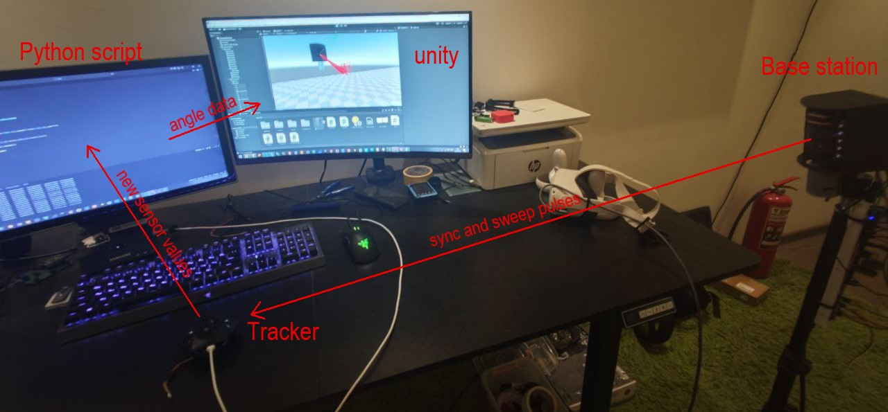
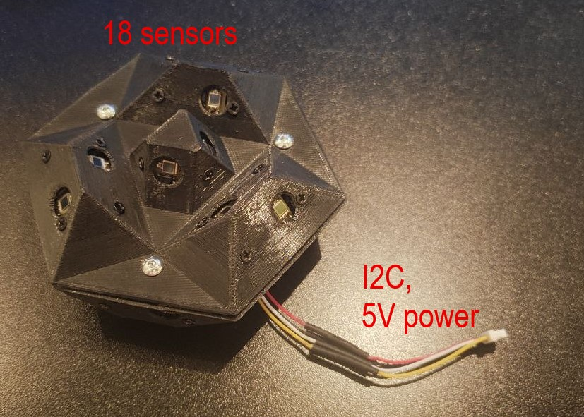
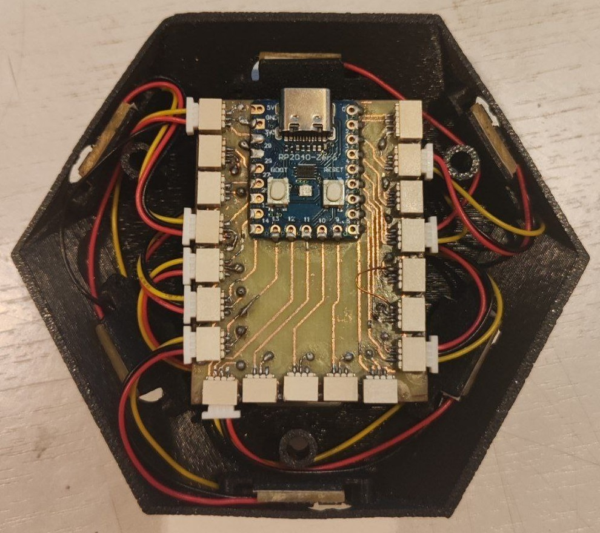
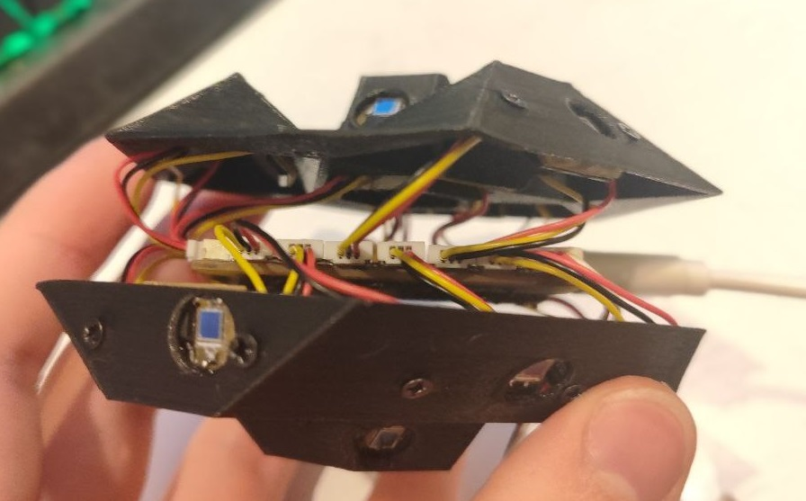
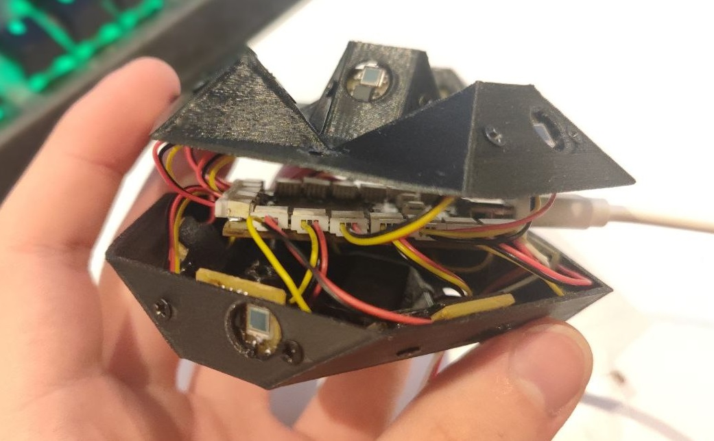
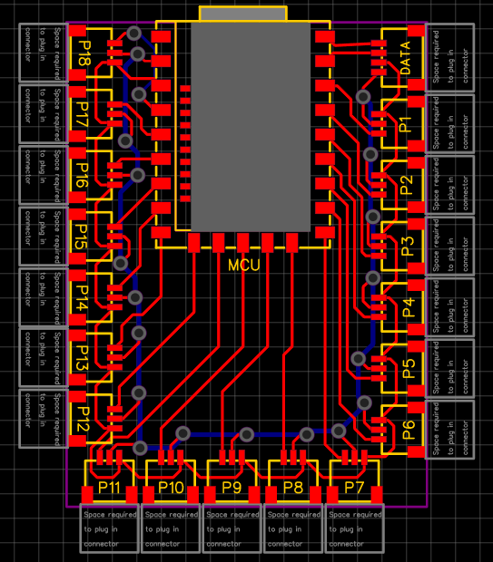

# NVVR lighthouse tracking solution V1
## Latest update

Got most of the stuff working properly.

Base station remained unchanged (however i think its about time to replace it`s breadboard with a more permanent protoboard and resolve problems with high jitter, low sync pulse timing accuracy and bad PID tuning, and i noticed that sync blinker isnt powerful enough even for > 2 meters).

The tracker now uses RP2040-Zero board. Firmware utilizes 4 PIOs (2 pairs of new sensor data checker + changes time stamper) and outputs from those PIOs are sent into chained DMAs without using cpu resources, then this data is pulled from DMAs into queues and sent to the COM port by the other core.

The python program reads packets from the tracker and tries to separate sync and sweep pulses for each sensor and checks if previous frame is complete on sync pulse events. Then it calculates angle data (not the actual X and Y angles because of base station`s lenses arangement) and sends it to unity via TCP connection.

Unity reads angle data from TCP connection, then fixes the angles (lenses are rotated 45deg in relation to the base station and 90 deg from each other, and when laser lines overlap, they form an X shape) and draws them as red rays.

TODO: finally write a 6DOF position solver.

## Base station V1.6

### IR shots

### Mechanical scheme

### Electrical scheme

## Prototype htc wand inspired tracked object V1.2 (work in progress)
### Real life pictures

### PCB design

### CAD model

### Real life pictures

### Real life valve prototypes pictures

# Old stuff
## 4-sensor tracker V1.1 (obsolete)

### Sensor scheme

### Sensor PCB

## Software

## Random data

## Contact
Telegram: @nvcoder

Email: nv.coder@yandex.ru