# NVVR lighthouse tracking solution V1
## Base station V1.6

### IR shots
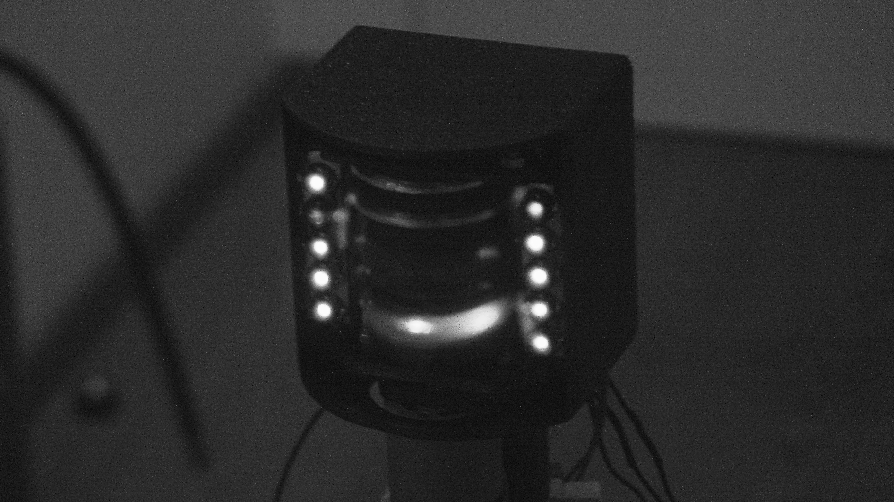
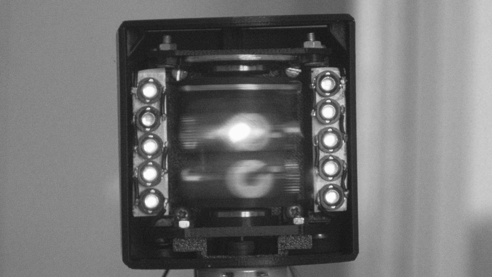

### Mechanical scheme
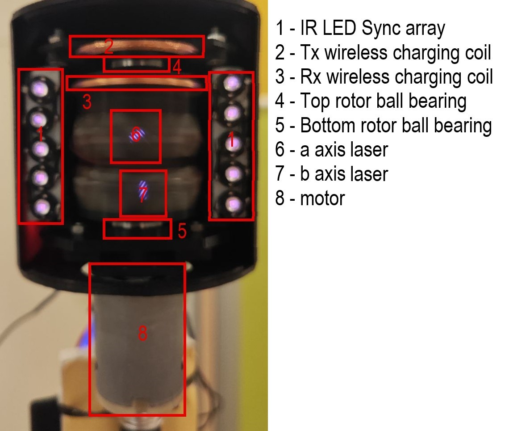

### Electrical scheme
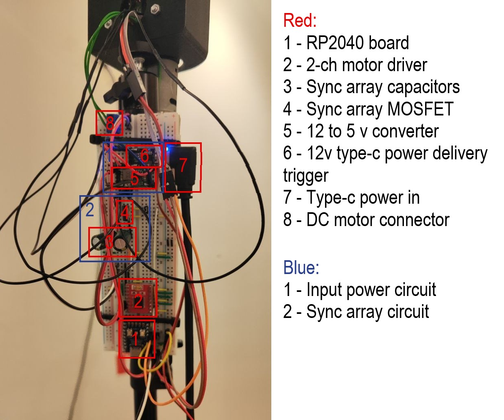

## 4-sensor tracker V1.1

### Sensor scheme
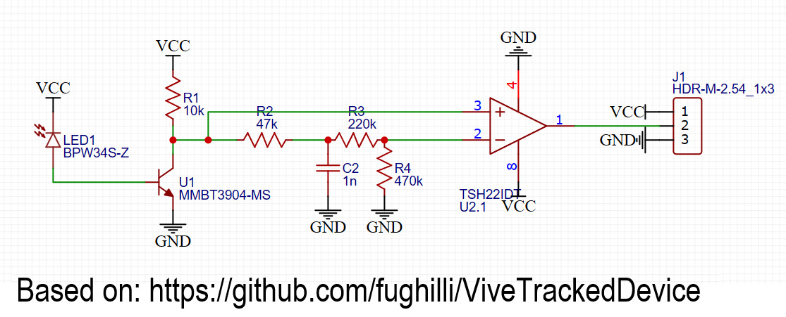

### Sensor PCB

## Software

## Random data
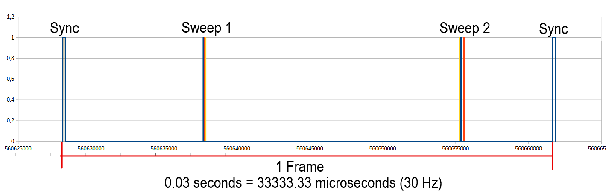
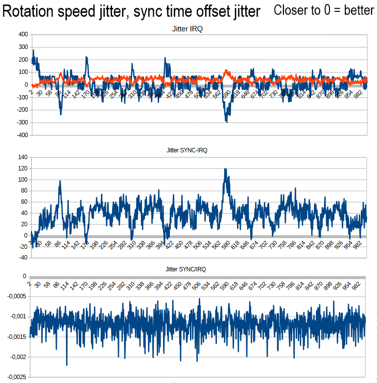

## Prototype htc wand inspired tracked object V1.2 (work in progress)
### CAD model
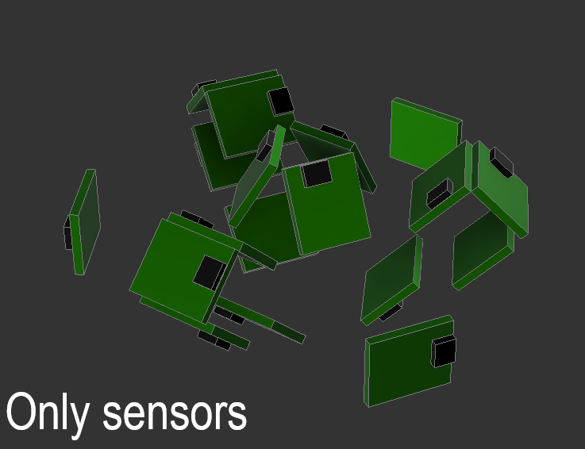
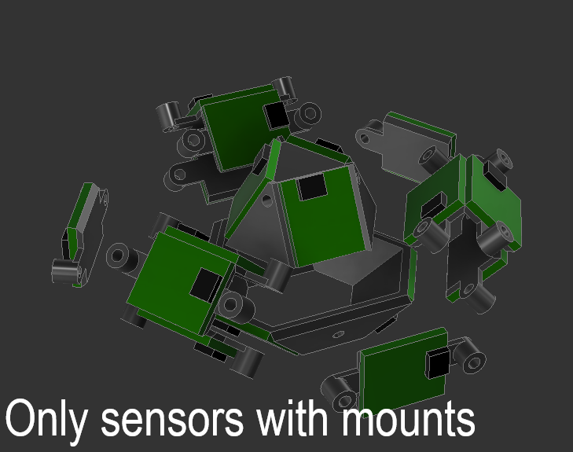
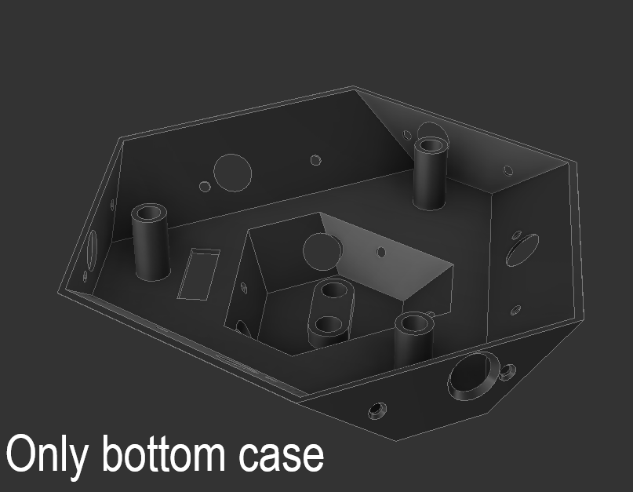
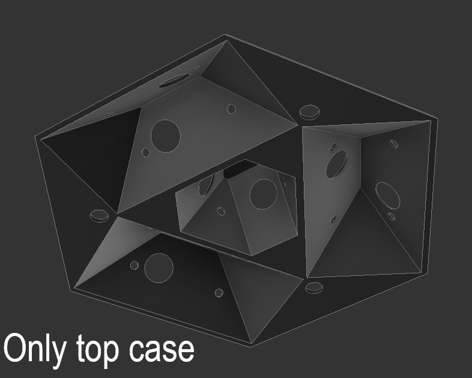
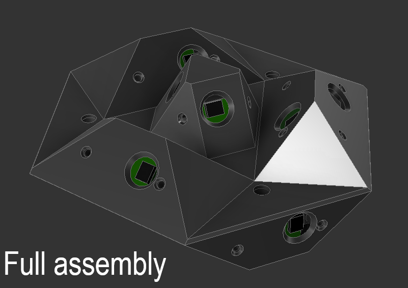

### Real life pictures
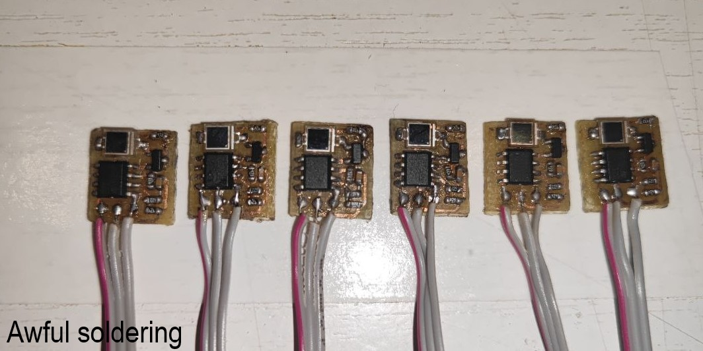
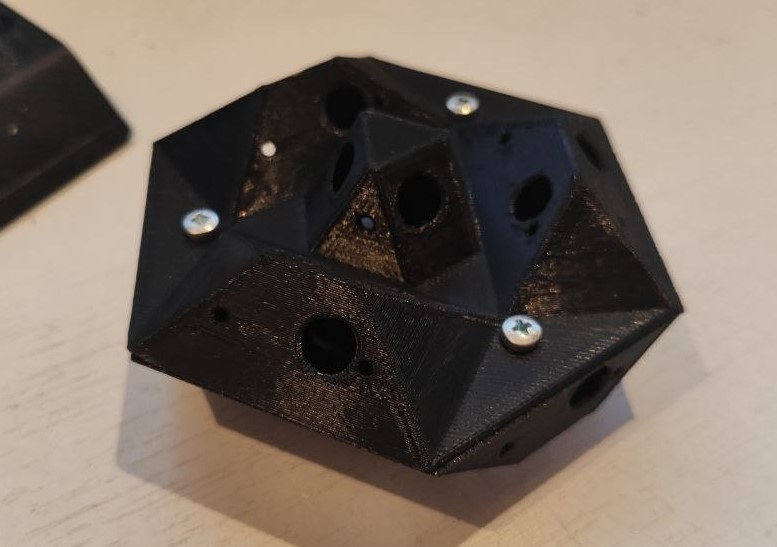

### Real life valve prototypes pictures
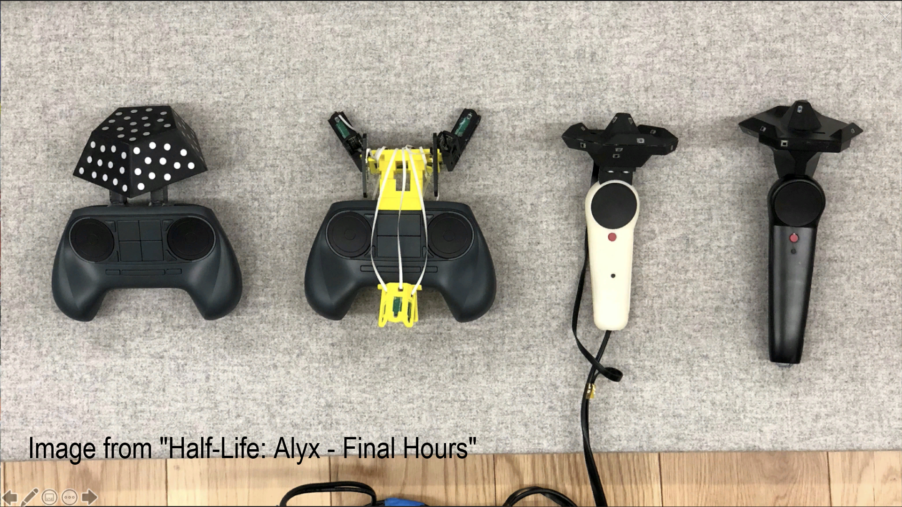
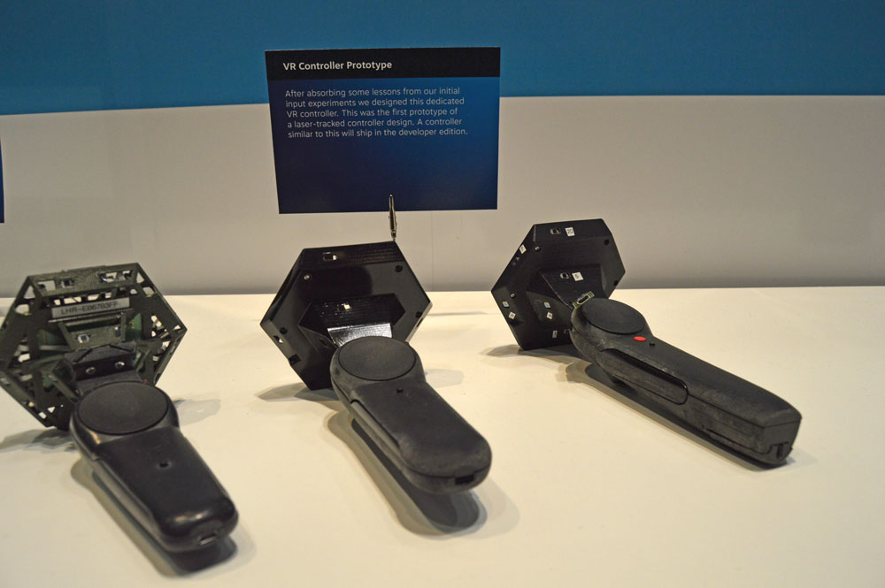

## Contact
Telegram: @nvcoder

Email: nv.coder@yandex.ru